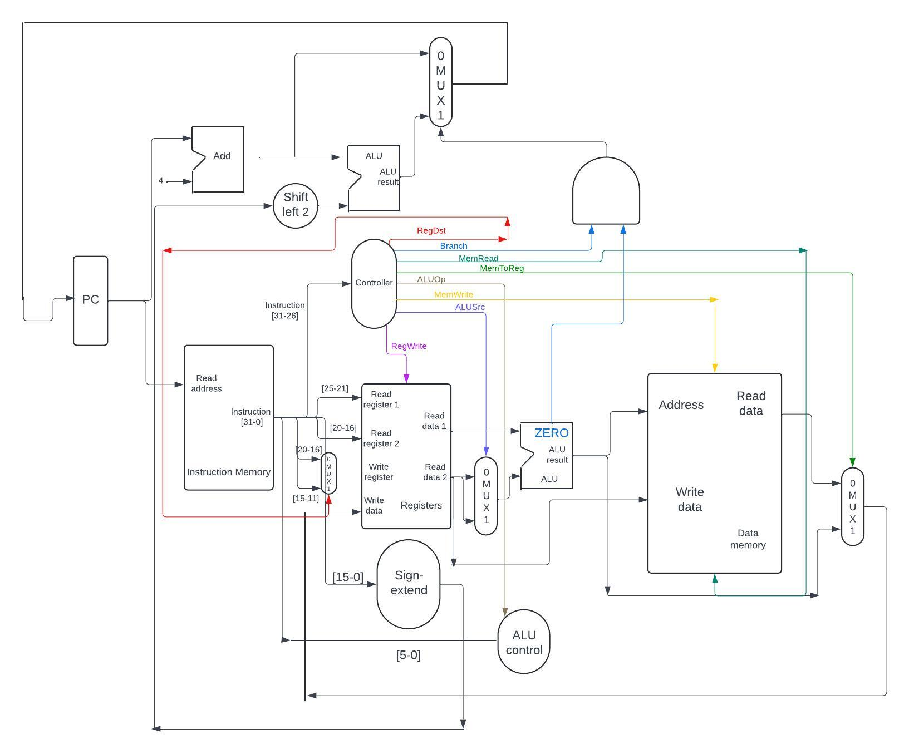
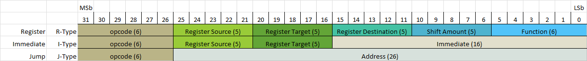
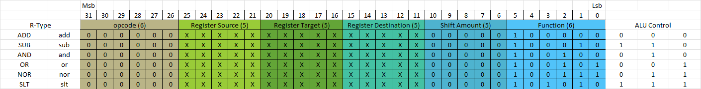
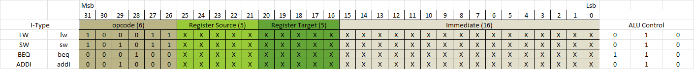
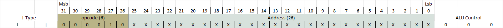
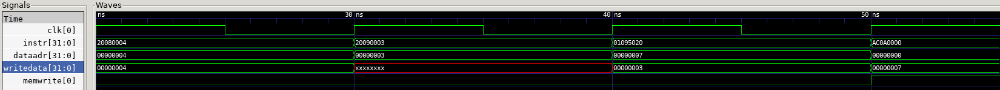
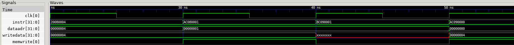
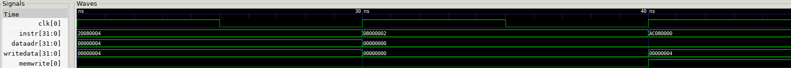

# Veripog

ECE-251: Spring 2024

## Instruction Set for Single-Cycle MIPS Processor

| ISA Aspect                 | Implementation                                   |
|----------------------------|--------------------------------------------------|
| ALU Operand Size           | 32 bits                                          |
| Address Bus Size           | 32 bits                                          |
| Addressability             | Byte addressable                                 |
| Register File Size         | 32 registers, each 32 bits wide                  |
| Opcode Size                | 6 bits                                           |
| Function Size              | 6 bits                                           |
| shamt Size                 | 5 bits                                           |
| Instruction Length         | 32 bits                                          |
| PC Increment               | 4 bytes                                          |
| Immediate Size             | 16 bits                                          |
| R-type Instruction Support | `ADD`, `SUB`, `AND`, `OR`, `SLT`, `NOR`          |
| I-type Instruction Support | `LW`, `SW`, `BEQ`, `ADDI`                        |
| J-type Instruction Support | `J`                                              |
| Memory Reference Support   | Yes                                              |
| Total Memory Size          | 64 words (256 bytes)                             |

## Datapath Diagram



### R-Type Instructions

| Name | Mnemonic | Operation                       | Opcode / Funct  | Opcode / Funct (Binary)     |
|------|----------|---------------------------------|-----------------|-----------------------------|
| ADD  | `add`    | R[rd] = R[rs] + R[rt]           | $0 / 20_{hex}$  | 000000 / 100000             |
| SUB  | `sub`    | R[rd] = R[rs] - R[rt]           | $0 / 22_{hex}$  | 000000 / 100010             |
| AND  | `and`    | R[rd] = R[rs] & R[rt]           | $0 / 24_{hex}$  | 000000 / 100100             |
| OR   | `or`     | R[rd] = R[rs] \| R[rt]          | $0 / 25_{hex}$  | 000000 / 100101             |
| NOR  | `nor`    | R[rd] = ~(R[rs] \| R[rt])       | $0 / 27_{hex}$  | 000000 / 100111             |
| SLT  | `slt`    | R[rd] = (R[rs] < R[rt]) ? 1 : 0 | $0 / 2A_{hex}$  | 000000 / 101010             |

### I-Type Instructions

| Name   | Mnemonic | Operation                                      | Opcode       | Opcode (Binary)  |
|--------|----------|------------------------------------------------|--------------|------------------|
| LW     | `lw`     | R[rt] = M[R[rs]+SignExtImm]                    | $23_{hex}$   | 100011           |
| SW     | `sw`     | M[R[rs]+SignExtImm] = R[rt]                    | $2B_{hex}$   | 101011           |
| BEQ    | `beq`    | if(R[rs]==R[rt]) <br>&nbsp; PC=PC+4+BranchAddr | $14_{hex}$   | 000100           |
| ADDI   | `addi`   | R[rt] = R[rs] + SignExtImm                     | $08_{hex}$   | 001000           |

### J-Type Instructions

| Name | Mnemonic | Operation      | Opcode       | Opcode (Binary)  |
|------|----------|----------------|--------------|------------------|
| J    | `j`      | PC = JumpAddr  | $02_{hex}$   | 000010           |

### Instruction Formats



### R-type instructions



### I-type instructions



### J-type instructions



## Control Signal Mapping for MIPS Instructions

### I-type Instructions

| **Instruction** | `RegWrite` | `RegDst` | `ALUSrc` | `Branch` | `MemWrite` | `MemtoReg` | `Jump` | `ALUOp` |
| `LW`            | 1          | 0        | 1        | 0        | 0          | 1          | 0      | 00      |
| `SW`            | 0          | X        | 1        | 0        | 1          | X          | 0      | 00      |
| `BEQ`           | 0          | X        | 0        | 1        | 0          | X          | 0      | 01      |
| `ADDI`          | 1          | 0        | 1        | 0        | 0          | 0          | 0      | 00      |

### R-type Instructions

| **R-type Instruction** | `RegWrite` | `RegDst` | `ALUSrc` | `Branch` | `MemWrite` | `MemtoReg` | `Jump` | `ALUOp` |
|------------------------|------------|----------|----------|----------|------------|------------|--------|---------|
| `ADD`                  | 1          | 1        | 0        | 0        | 0          | 0          | 0      | 10      |
| `SUB`                  | 1          | 1        | 0        | 0        | 0          | 0          | 0      | 10      |
| `AND`                  | 1          | 1        | 0        | 0        | 0          | 0          | 0      | 10      |
| `OR`                   | 1          | 1        | 0        | 0        | 0          | 0          | 0      | 10      |
| `NOR`                  | 1          | 1        | 0        | 0        | 0          | 0          | 0      | 10      |
| `SLT`                  | 1          | 1        | 0        | 0        | 0          | 0          | 0      | 10      |

### Jump Instruction

| **Jump Instruction** | `RegWrite` | `RegDst` | `ALUSrc` | `Branch` | `MemWrite` | `MemtoReg` | `Jump` | `ALUOp` |
|----------------------|------------|----------|----------|----------|------------|------------|--------|---------|
| `J`                  | 0          | X        | X        | 0        | 0          | X          | 1      | XX      |

### Explanation of Columns

- **Instruction**: MIPS assembly instruction.
- **RegWrite**: Enables writing to the register file.
- **RegDst**: Determines the destination register (1 for `rd` field, 0 for `rt` field).
- **ALUSrc**: Selects the second ALU operand (0 for register, 1 for immediate value).
- **Branch**: Determines if the instruction is a branch instruction (e.g., `BEQ`).
- **MemWrite**: Enables writing to data memory.
- **MemtoReg**: Selects the value to write back to the register (1 for data memory output, 0 for ALU result).
- **Jump**: Indicates a jump instruction.
- **ALUOp**: Specifies the type of ALU operation (00 for `LW`/`SW`, 01 for `BEQ`, 10 for R-type, and others for specific operations like `ADDI`).
- **ALUControl**: The specific ALU operation code (e.g., 010 for add, 110 for sub), often determined by the combination of `ALUOp` and the funct field for R-type instructions.

## Timing Diagrams

### R-type Timing Diagram



```txt
00000000: 20080004 <- addi $t0, $zero, 4      # $t0 = 4
00000004: 20090003 <- addi $t1, $zero, 3      # $t1 = 3
00000008: 01095020 <- add $t2, $t0, $t1       # $t3 = 4 + 3 = 7
0000000c: ac0a0000 <- sw $t2, 0($zero)        # Store at address 0
```

### I-type Timing Diagram



```txt
00000000: 20080004 <- addi $t0, $zero, 4      # $t0 = 4
00000004: ac080001 <- sw $t0, 1($zero)        # Store at address 1
00000008: 8c090001 <- lw $t1, 1($zero)        # Load data
0000000c: ac090000 <- sw $t1, 0($zero)        # Store at address 0
```

### J-type Timing Diagram



```txt
00000000: 20080004 <- addi $t0, $zero, 4      # $t0 = 4
00000004: 08000002 <- j    end                # jump to end
00000008: ac080000 <- sw $t0, 0($zero)        # Store at address 0
```

## Registers

| NAME      | NUMBER   | USE                                                   | PRESERVED ACROSS A CALL? |
|-----------|----------|-------------------------------------------------------|--------------------------|
| $zero     | 0        | The Constant Value 0                                  | N.A.                     |
| $at       | 1        | Assembler Temporary                                   | No                       |
| \$v0-$v1  | 2-3      | Values for Function Results and Expression Evaluation | No                       |
| \$a0-$a4  | 4-8      | Arguments                                             | No                       |
| \$t0-$t9  | 9-18     | Temporaries                                           | No                       |
| \$s0-$s8  | 19-27    | Saved Temporaries                                     | Yes                      |
| $gp       | 28       | Global Pointer                                        | Yes                      |
| $sp       | 29       | Stack Pointer                                         | Yes                      |
| $fp       | 30       | Frame Pointer                                         | Yes                      |
| $ra       | 31       | Return Address                                        | No                       |

## Fibonnaci Program

### fib.asm

```txt
main:
    addi $at, $zero, 0       # Initialize $at (assembler temporary) to 0 (Fibonacci(0))
    addi $v0, $zero, 1       # Initialize $v0 (value for function result) to 1 (Fibonacci(1))
    addi $a0, $zero, 2       # Initialize $a0 (argument) to 2 (counter starts at 2)
    addi $a1, $zero, 8       # Initialize $a1 (argument) to 8 (target Fibonacci index)

loop:
    beq  $a0, $a1, finish    # If counter ($a0) equals 8, exit the loop
    add  $v1, $at, $v0       # $v1 (value for function result) = $at + $v0 (next Fibonacci number)
    add  $at, $zero, $v0     # $at = $v0 (update $at for the next iteration)
    add  $v0, $zero, $v1     # $v0 = $v1 (update $v0 for the next iteration)
    addi $a0, $a0, 1         # Increment counter ($a0)
    j    loop                # Repeat the loop

finish:
    sw   $v0, 0($zero)       # Store the 8th Fibonacci number in memory address 0

end:
    j    end                 # Loop forever (end of program)
```

### fib.txt

```txt
00000000: addi $at, $zero, 0       # Initialize $at (assembler temporary) to 0 (Fibonacci(0)) -> 20010000
00000004: addi $v0, $zero, 1       # Initialize $v0 (value for function result) to 1 (Fibonacci(1)) -> 20020001
00000008: addi $a0, $zero, 2       # Initialize $a0 (argument) to 2 (counter starts at 2) -> 20040002
0000000c: addi $a1, $zero, 8       # Initialize $a1 (argument) to 8 (target Fibonacci index) -> 20050008
00000010: beq  $a0, $a1, finish    # If counter ($a0) equals 8, exit the loop -> 10850005
00000014: add  $v1, $at, $v0       # $v1 (value for function result) = $at + $v0 (next Fibonacci number) -> 00221820
00000018: add  $at, $zero, $v0     # $at = $v0 (update $at for the next iteration) -> 00020820
0000001c: add  $v0, $zero, $v1     # $v0 = $v1 (update $v0 for the next iteration) -> 00031020
00000020: addi $a0, $a0, 1         # Increment counter ($a0) -> 20840001
00000024: j    loop                # Repeat the loop -> 08000004
00000028: sw   $v0, 0($zero)       # Store the 8th Fibonacci number in memory address 0 -> ac020000
0000002c: j    end                 # Loop forever (end of program) -> 0800000b
```

### fib.dat

```txt
20010000
20020001
20040002
20050008
10850005
00221820
00020820
00031020
20840001
08000004
ac020000
0800000b
```
