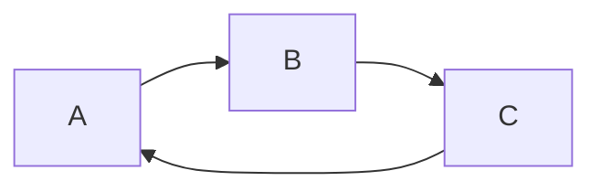

# ISA

## Answers

### Step 1: Define Basic Characteristics

1. **Operand Size**: How wide do you want your data paths to be? Common choices are 8, 16, 32, or 64 bits. This will dictate the size of your operands.
16
2. **Address Bus Size**: What memory capacity do you aim to address? For instance, a 16-bit address bus can address up to 64KB of memory.
16
3. **Addressability**: Do you want byte-addressable or word-addressable memory? Byte-addressable allows more fine-grained control but may increase complexity.
word-addressable
4. **Register File Size**: How many general-purpose registers will your processor have?
7
5. **Opcode Size**: How many operations do you want your ISA to support? This will determine the size of your opcode field.
5
6. **Immediate Size**: How large are the immediate values in your I-type instructions?
16
7. **Function, shamt Sizes**: If applicable, specify the sizes for any function or shift amounts used in your instruction formats.
4 bit function field and 4 bit shamt

### Step 2: Instruction Formats

Decide the structure of your instruction formats:

1. **R-type Instructions**: Typically used for arithmetic and logic operations between registers.
2. **I-type Instructions**: Used for immediate operations, load, store, and branches.
3. **J-type Instructions**: Used for jumps.

**Question**: What specific operations do you want to support in R-type, I-type, and J-type formats?

#### R-type Instructions

- **Purpose**: Handle arithmetic and logical operations between registers.
- **Operations**: ADD, SUB, MUL, DIV, AND, OR, XOR, NOT, shift operations (SLL, SRL, SRA), and MOV.

#### I-type Instructions

- **Purpose**: Include operations with immediate values, load and store data, and handle conditional branches.
- **Operations**: ADDI, SUBI, ANDI, ORI, LW, SW, BEQ, BNE, BLT, BLE.

#### J-type Instructions

- **Purpose**: Used for jumps and function calls.
- **Operations**: J (jump), JAL (jump and link).

### Step 3: Memory Design

1. **Instruction Memory**: Determine the layout and access method.
2. **Data Memory**: Decide on the structure and how it interacts with the processor.

**Question**: What are your thoughts on how instructions and data should be loaded and accessed?

#### Instruction Memory

- **Purpose**: Stores and serves executable code.
- **Layout**: Typically implemented as ROM or dedicated RAM section.
- **Access Method**: Primarily sequential but must support random access for handling control flow changes like jumps and branches.

#### Data Memory

- **Purpose**: Holds data used by the CPU for program execution.
- **Structure**: Separated from instruction memory to allow simultaneous access, enhancing performance.
- **Interaction with Processor**:
  - **Direct and Indirect Addressing**: Supports both methods to accommodate different data manipulation needs.
  - **Read/Write Capable**: Essential for dynamic data handling.

### Step 4: Processor Design

1. **Datapath Components**: This includes the ALU, registers, multiplexers, and program counters.
2. **Control Signals**: Define the signals needed for operations like register writes, memory access, and branching.
3. **Clock Design**: Decide how your clock will operate and influence the processor.

**Question**: What kind of operations should the ALU support?

#### Arithmetic Operations

- **ADD**: Addition
- **SUB**: Subtraction
- **MUL**: Multiplication
- **DIV**: Division

#### Logical Operations

- **AND**
- **OR**
- **XOR**
- **NOT**

#### Shift Operations

- **SLL** (Shift Left Logical)
- **SRL** (Shift Right Logical)
- **SRA** (Shift Right Arithmetic)

#### Additional Useful Operations

- **CMP** (Compare)
- **SLT** (Set on Less Than)

### Step 5: Implement a Sample Program

Select a simple program, such as calculating Fibonacci numbers or a factorial, to demonstrate your ISA’s functionality.

**Action Required**: Could you provide a simple algorithm that you’d like to implement using your ISA?

#### Fibonacci Algorithm Outline

1. **Initialize**: Set F0 = 0 in R1 and F1 = 1 in R2.
2. **Input Check**:
   - If N (in R0) is 0, return F0 from R1.
   - If N is 1, return F1 from R2.
3. **Calculate**:
   - For N >= 2, loop from 2 to N:
     - Fn = F(n-1) + F(n-2) (Add R1 and R2, store result in R3).
     - Update F(n-2) in R1 with F(n-1) from R2.
     - Update F(n-1) in R2 with Fn from R3.
4. **Return**: Output Fibonacci number stored in R2.

#### Implementation in ISA

1. **Initialization**:
   - `LOADI R1, 0` (Load immediate 0 into R1)
   - `LOADI R2, 1` (Load immediate 1 into R2)
2. **Input Checks**:
   - `CMP R0, R1` (Compare N with 0)
   - `BEQ OUTPUT` (Branch to output if N == 0)
   - `CMP R0, R2` (Compare N with 1)
   - `BEQ OUTPUT` (Branch to output if N == 1)
3. **Loop Setup**:
   - `LOADI R3, 2` (Start loop counter at 2)
   - `LOOP:`
4. **Fibonacci Calculation**:
   - `ADD R3, R1, R2` (R3 = R1 + R2)
   - `MOV R1, R2` (Move R2 to R1)
   - `MOV R2, R3` (Move R3 to R2)
5. **Loop Control**:
   - `INC R3`
   - `CMP R3, R0`
   - `BLE LOOP` (Loop back if counter <= N)
6. **Output**:
   - `OUTPUT: MOV OUT, R2` (Move result to output register)

### Step 6: Documentation

1. **Overall Design Explanation**: Describe your design in detail.
2. **Design Diagrams**: Include block diagrams and timing diagrams for different types of instructions.
3. **Demo Instructions**: Explain how to load, run, and demonstrate programs on your processor.

**Question**: What format and tools do you prefer for creating and maintaining documentation?
markdown for documentation and write mermaid code for diagrams

